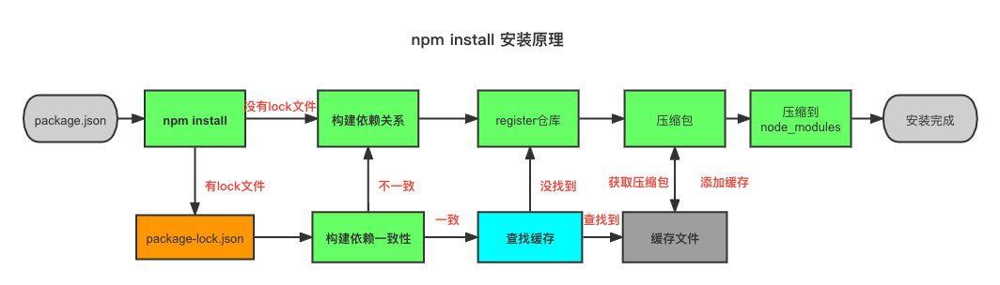

### npm 管理地址

npm 地址：`npmjs.org` 用来进行记录仓库中包
包的代码地址：register 是真正用来存放我们包的代码的，所以我们一般甚至 npm 源的时候使用`register 开头`

### 包的项目配置文件

- `package.json`文件: 描述了项目配置信息

  - 常见属性：
    name 是项目的名称
    version 当前项目的本版本号
    description 描述信息
    author: 项目坐着
    private: 记录当前的项目是私有的，当值设置为 true，npm 包是不能被发布的，防止私有的项目或者模块被发布上去
    scripts
    dependencies `npm install packageName -S` `npm install --production`只会安装生产依赖的包
    devDependencies `npm install packageName -D`

- 版本问题管理
  - 遵循的是 semver 的管理方式 `x.y.z`
  - x.y.z
    - x 主版本号(major): 当兼容的 API 不能发生兼容的时候发生变化
    - y 次版本号(minor): 当向下兼容的新增功能特性 (向下兼容,新功能增加)
    - z 修订号(pathch): 当做了向下兼容问题的修正 (无新功能增加，bug 修改)
  - ^和~的区别
    ^x.y.z: 表示 x 保持不变，y 和 z 永远安装最新的版本
    ~x.y.z: 表示 x 和 y 保持不变，z 永远安装的是最新的版本
  - engines 属性：指向 node 和 npm 的版本
  - browserslist 属性：配置浏览器版本补丁的兼容性
- npm install 命令

  1. 安装包的两种情况
     1. 全局安装 `npm install yarn -g`
     2. 局部安装: `npm install yarn`
        npm install 的安装原理
        

- package-lock.json

  - 当前文件中安装是真实的版本, 当前我们`package.json` 中安装的文件版本规则符合 lock.json 中的版本，安装 lock 中版本，如果不符合直接按照 package.json 中的文件版本安装，最后跟新 lock 中版本
  - npm 包缓存路径`npm config get cache` => `user/local/.npm`
  - npm 清除缓存 `npm cache clean --force`
  - npm list: 查看包依赖的版本树
  - npm view jquery versions: 查看包的版本
  - npm update
  - npm outdated

- 当前 npm 源的切换
  - `npm config set register XXX`
  - package.json 中配置自定义变量
  ```js
  // 自定义配置
  config: {
    env: "production";
  }
  // 环境变量获取
  console.log(process.env.npm_package_config_env);
  ```

### 模块

- \_\_dirname: 当前文件所在的物理路径
